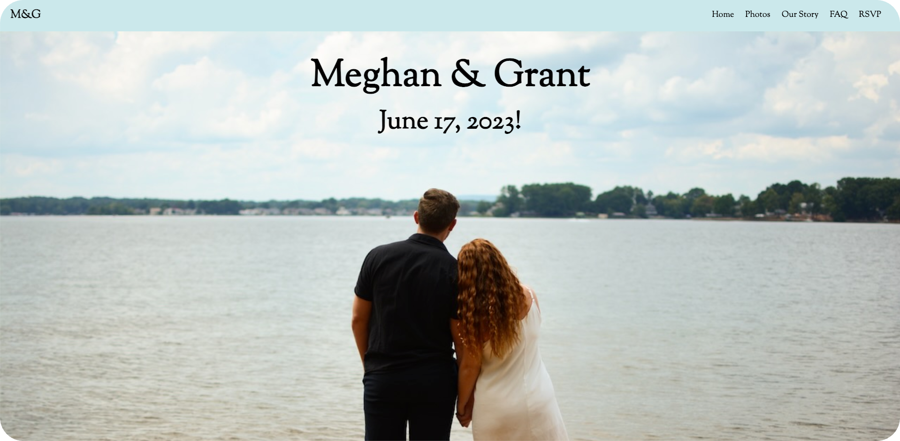

# Wedding Website



This is a wedding website project created using Angular and hosted on Firebase. The website contains various sections such as home, photo album, our story, FAQ, and RSVP. It also connects to Firestore to store the RSVP information from all attendees.

## Features

- Home page
- Photo album page
- Our story page
- FAQ page
- RSVP page
- Connection to Firestore for storing RSVP data

## Prerequisites

- Node.js (https://nodejs.org/)
- Angular CLI (https://cli.angular.io/)
- Firebase CLI (https://firebase.google.com/docs/cli)

## Getting Started

To get this website running on your local machine, follow these steps:

1. Clone this repository to your local machine:

```bash
gh repo clone grantrisk/angular-wedding-website
```

2. Navigate to the project folder:

```bash
cd angular-wedding-website
```

3. Install the required dependencies:

```bash
npm install
```

4. Set up your Firebase project by following the instructions here: https://firebase.google.com/docs/web/setup

5. Replace the firebaseConfig object in the `src/environments/environment.ts` file with your own Firebase project configuration.

6. Install the Firebase CLI globally:

```bash
npm install -g @angular/fire @google-cloud/firestore
```

7. Log in to your Firebase account:

```bash
firebase login
```

8. Connect your local project to your Firebase project:

```bash
firebase use --add
```

Select your Firebase project from the list.

9. Run the Angular development server:

```bash
ng serve
```

The website will be accessible at `http://localhost:4200/`.

## Deployment

To deploy the website to Firebase Hosting, follow these steps:

1. Build the project for production:

```bash
ng build --prod
```

2. Deploy the project to Firebase:

```bash
firebase deploy
```

## License

This project is licensed under the MIT License - see the [LICENSE](LICENSE) file for details.
